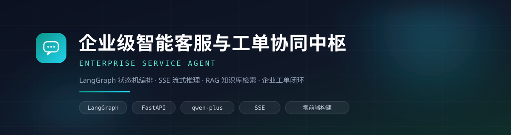
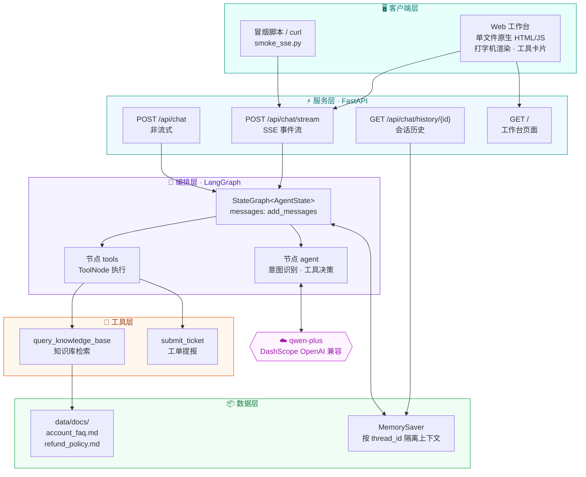
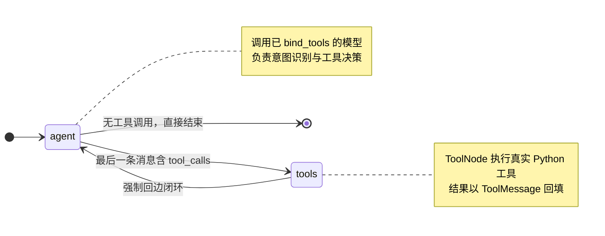
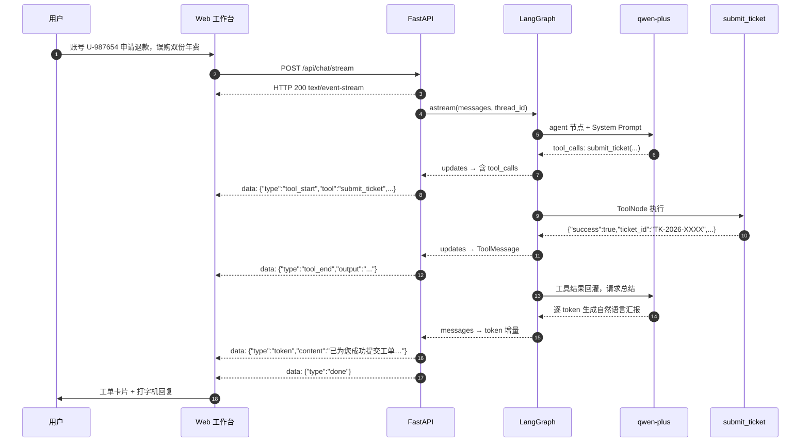
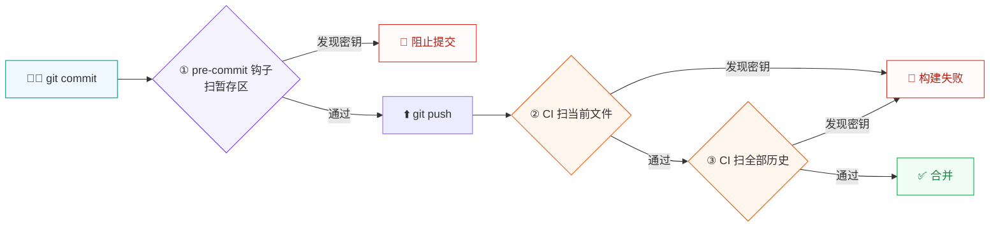

<div align="center">



**用 LangGraph 编排的企业级智能售后支持系统**

从知识库检索到工单闭环，一次对话完成 —— 全程 SSE 流式输出。

[](https://www.python.org/)
[](https://github.com/langchain-ai/langgraph)
[](https://fastapi.tiangolo.com/)
[](https://bailian.console.aliyun.com/)
[](#流式协议)
[](#web-工作台)
[](#密钥泄漏防护)

</div>

---

## 📖 目录

- [项目简介](#项目简介)
- [核心特性](#核心特性)
- [系统架构](#系统架构)
- [功能演示](#功能演示)
- [快速开始](#快速开始)
- [测试体系](#测试体系)
- [流式协议](#流式协议)
- [项目结构](#项目结构)
- [关键设计决策](#关键设计决策)
- [密钥泄漏防护](#密钥泄漏防护)
- [验证边界](#验证边界)

---

## 🎯 项目简介

企业客服场景里，**"能查到政策"** 和 **"能办成事"** 是两件不同的事。
本项目把两者收敛进**同一个对话状态机**：

- 客户问「403 权限不足怎么解决」→ 检索企业知识库，**基于文档原文**作答，不臆造政策；
- 客户说「买错套餐了，帮我退费」→ 识别为**办理类意图**，自动进入**槽位填充**：
  缺账号就反问，参数齐备立即提单，返回 `TK-2026-XXXX` 流水号并汇报 SLA。

整个推理与工具调用过程通过 **SSE 逐 token 推送到浏览器**，客服与客户都能实时看到
"正在检索知识库 → 检索完成 → 正在提交工单 → 已受理" 的完整链路。

> **设计立场**：工具调用的**触发器是模型**，但**约束是代码与 Prompt 共同强制的**。
> 详见 [关键设计决策](#关键设计决策)。

---

## ✨ 核心特性

| | 能力 | 说明 |
|---|---|---|
| 🧠 | **状态机编排** | LangGraph `StateGraph`，`agent ⇄ tools` 闭环；工具执行后强制回边，由模型把工具返回的 JSON 转写成**面向客户的得体回复**，而非直接抛 JSON |
| 📚 | **RAG 知识库检索** | 标题感知切片 + 关键词加权打分，`data/docs/` 下 Markdown 即知识源；**无需向量库**即可跑通 |
| 🎫 | **工单槽位填充** | 三必需参数（`user_id` / `issue_type` / `description`）校验；缺参**禁止**调用工具，改为亲切反问 |
| ⚡ | **SSE 流式推送** | `token` / `tool_start` / `tool_end` / `error` / `done` 五类事件，工具生命周期对前端完全透明 |
| 🖥️ | **零构建前端** | 单文件原生 HTML + JS，**无 Node.js / npm / 打包步骤**；打字机渲染 + 可折叠工具卡片 |
| 🧩 | **离线自愈** | 未配置 API Key 时自动切换确定性 mock 模型，**图结构与路由仍可完整验证** |
| 🔒 | **密钥防护** | 自研扫描器（9 类强特征 + 熵值弱特征）+ pre-commit 钩子 + CI 兜底，三层拦截 |

**代码规模**：Python `2,827` 行 · 前端 `1,070` 行 · 知识库 `310` 行 · **总计约 4,200 行**

---

## 🏗️ 系统架构

### 分层视图



### 状态机拓扑

这是**运行时真实拓扑**（由 `app.get_graph()` 导出，非手绘示意）：



| 节点 | 职责 |
|---|---|
| `agent` | 注入 System Prompt，调用绑定工具的模型，产出回复或工具调用请求 |
| `tools` | `ToolNode([query_knowledge_base, submit_ticket])` 执行真实业务函数 |

| 边 | 条件 |
|---|---|
| `START → agent` | 无条件 |
| `agent → tools` | `should_continue` 检测到最后一条 AI 消息含 `tool_calls` |
| `agent → END` | 无 `tool_calls`，本轮对话完成 |
| `tools → agent` | **强制回边** —— 让模型基于工具结果组织自然语言汇报 |

### 一次工单请求的时序



---

## 🎬 功能演示

### Web 工作台

左侧为会话状态面板（服务状态 / 模型 / Session ID / 实时指标 / 工具调用轨迹），
右侧为消息对话流，输入框上方提供三个一键快捷场景。

```
┌────────────────────────┬──────────────────────────────────────────────────┐
│  💬 智能客服中枢        │  企业客服工作台                    [qwen-plus]    │
│  Enterprise Service    │  账号排障 · 权限申诉 · 退款与工单协同   [新建会话] │
│                        ├──────────────────────────────────────────────────┤
│  系统状态              │                                                  │
│  ● 服务      在线      │   ┌───┐  你好，系统登录提示 403 权限不足          │
│  ● 模型   qwen-plus    │   │ 我 │  怎么排查解决？                          │
│  ● 会话  web-m8x2…     │   └───┘                                          │
│  ● 模式  DashScope     │                                                  │
│                        │   ┌───┐  ┌────────────────────────────────────┐  │
│  本次会话指标          │   │AI │  │ 🔍 正在检索企业知识库…       ⌄     │  │
│  ┌────────┬────────┐   │   └───┘  └────────────────────────────────────┘  │
│  │   1    │   1    │   │          ┌────────────────────────────────────┐  │
│  │ 对话轮次│ 工具调用│   │          │ ✅ 知识库检索完成            ›     │  │
│  ├────────┼────────┤   │          └────────────────────────────────────┘  │
│  │   84   │  0.6s  │   │          ┌────────────────────────────────────┐  │
│  │Token片段│ 最近耗时│   │          │ 根据《账号排障指南》，403 属于      │  │
│  └────────┴────────┘   │          │ **授权层问题**，说明您已成功登录…   │  │
│                        │          │                                    │  │
│  工具调用轨迹          │          │ 1. 确认当前角色                    │  │
│  ✅ 知识库检索         │          │ 2. 核对所需权限                    │  │
│     14:26:41           │          │ 3. 检查 IP 白名单            ▍     │  │
│                        │          └────────────────────────────────────┘  │
│  已挂载工具            │                                                  │
│  [🔍 知识库检索]       │   ┌──────────────────────────────────────────┐   │
│  [📋 工单提报]         │   │ 🔍 403 权限不足… │ 📋 买错套餐… │ ✅ 账号… │   │
│                        │   ├──────────────────────────────────────────┤   │
│  LangGraph 状态机·SSE  │   │ 描述您遇到的问题…              [ 发送 ]  │   │
└────────────────────────┴──────────────────────────────────────────────────┘
```

### 三个真实场景

> 以下为用户实际运行 `python -m src.agent.customer_agent`（真实 `qwen-plus`）的输出摘要。

<table>
<tr><th width="180">场景</th><th>输入与结果</th></tr>
<tr>
<td><b>① 知识库问答</b><br/><sub>预期：检索并基于文档作答</sub></td>
<td>

**用户**：你好，系统登录提示 403 权限不足怎么排查解决？

**节点流转**：`agent → tools → agent`（3 步）

**工具调用**：`query_knowledge_base(query='403 权限不足怎么解决')`

**结果**：正确归类为「授权层问题」，给出自助 3 步 + 需管理员配合的操作，并主动说明
*"出于安全合规要求，一线客服无法直接修改权限"* —— **完全来自知识库文档，无臆造**。

</td>
</tr>
<tr>
<td><b>② 槽位缺失反问</b><br/><sub>预期：不调用工具，自然语言反问</sub></td>
<td>

**用户**：我买错套餐了，帮我提个退费申请。

**节点流转**：`agent`（1 步，**未进入 tools 节点**）

**工具调用**：**无** ✅

**结果**：反问补充账号 ID 与诉求描述，并说明 *"这些信息仅用于定位账号与加速处理"*。

> 这是最关键的业务约束：模型**没有**用 `unknown` 之类的占位符硬凑参数去调用工具。

</td>
</tr>
<tr>
<td><b>③ 参数齐备提单</b><br/><sub>预期：调用 submit_ticket 闭环</sub></td>
<td>

**用户**：账号是 U-987654，我要申请退款，昨天购买的年费企业版误选了双份，申请退订一份。

**节点流转**：`agent → tools → agent`（3 步）

**工具调用**：`submit_ticket(user_id='U-987654', issue_type='refund', ...)`

**结果**：生成工单 `TK-2026-XXXX`，汇报受理组「财务结算组」与 SLA「首次响应 4 小时」。

</td>
</tr>
</table>

### 多轮槽位填充

同一 `thread_id` 下，上下文跨轮保持，用户只需补充缺失的那一项：

```
第 1 轮  用户：我买错套餐了，帮我提个退费申请。
         事件：token → done                      ← 无工具调用，反问补充 user_id

第 2 轮  用户：账号是 U-555111。
         事件：tool_start → tool_end → token → done
         工具：submit_ticket(
                 user_id="U-555111",
                 issue_type="refund",
                 description="我买错套餐了，帮我提个退费申请。\n账号是 U-555111。"
               )                                   ← 描述跨轮累积，未丢失原始诉求
```

### 终端流式验证（冒烟）

```console
$ python src/api/smoke_sse.py
==========================================================================
健康检查：status=ok | graph_ready=True | model_mode=dashscope
==========================================================================

【场景1 知识库问答】thread_id=sse-test-1
用户：你好，系统登录提示 403 权限不足怎么排查解决？
--------------------------------------------------------------------------
  HTTP 200 | Content-Type: text/event-stream; charset=utf-8
  [tool_start] query_knowledge_base  args={"query": "你好，系统登录提示 403 权限不足怎么排查解决？"}
  [tool_end]   query_knowledge_base  output(1259 字符) '【知识库检索结果】查询：…'
  [token]      '已为您检索到相关处理依据（来源：account_faq.md）：…'
  [done]       thread_id=sse-test-1
  事件序列：tool_start → tool_end → token → done

【场景2 槽位缺失反问】thread_id=sse-test-2
  [token]      '非常理解您希望尽快处理这件事，为了准确为您提交工单，还需要您补充以下信息：…'
  [done]       thread_id=sse-test-2
  事件序列：token → done
  ℹ 未触发工具

【场景3 参数齐备提交】thread_id=sse-test-3
  [tool_start] submit_ticket  args={"user_id": "U-987654", "issue_type": "refund", …}
  [tool_end]   submit_ticket  output(489 字符) '{"success": true, "ticket_id": "TK-2026-9289", …'
  [token]      '已为您成功提交工单，工单号 **TK-2026-9289**，当前状态「待受理」…'
  [done]       thread_id=sse-test-3
  ℹ 已调用 submit_ticket
==========================================================================
```

> 冒烟脚本只做目视提示（`ℹ` / `⚠`），**不做断言**。严格的行为校验由 `pytest` 承担，
> 见 [测试体系](#测试体系)。

---

## 🚀 快速开始

### 环境要求

- Python **3.10+**
- 一个**阿里云百炼 DashScope API Key**（[获取地址](https://bailian.console.aliyun.com/)）

### 1. 安装依赖

```bash
pip install -r requirements.txt
```

### 2. 配置密钥

```bash
cp .env.example .env        # Windows: Copy-Item .env.example .env
```

编辑 `.env`，填入你的密钥：

```ini
DASHSCOPE_API_KEY=sk-your-real-key-here
```

> ⚠️ `.env` 已被 `.gitignore` 忽略，**切勿提交**。仓库内置密钥扫描器会拦截误提交。

### 3. 启动服务

```bash
python -m src.api.main
```

| 入口 | 地址 |
|---|---|
| 🖥️ **Web 工作台** | <http://127.0.0.1:8000/> |
| 📘 接口文档 (Swagger) | <http://127.0.0.1:8000/docs> |
| 🔌 SSE 接口 | `POST http://127.0.0.1:8000/api/chat/stream` |

### 4. 验证

**方式一：自动化测试（推荐，含断言）**

```bash
pytest                    # 71 个用例，默认离线（mock 模型），约 8 秒
pytest -m real_model      # 额外验证真实 qwen-plus 是否遵守 Prompt（需 API Key）
```

**方式二：冒烟脚本（人眼观察流式输出）**

```bash
python src/api/smoke_sse.py     # 需先启动服务；仅目视确认，不做断言
```

**方式三：curl**

```bash
curl -N -X POST http://127.0.0.1:8000/api/chat/stream \
  -H "Content-Type: application/json" \
  -d '{"message":"403 权限不足怎么解决？","thread_id":"demo-1"}'
```

> PowerShell 下 `-d '{...}'` 会被引号解析破坏，建议写入文件后 `-d "@$env:TEMP\body.json"`。

**方式四：直接用状态机**（不经 HTTP 层）

```bash
python -m src.agent.customer_agent
```

### 无密钥离线运行

没有 API Key 也能验证**图结构、路由与槽位规则** —— 系统会自动切换到确定性 mock 模型：

```bash
# Linux / macOS
CUSTOMER_AGENT_MOCK=1 python -m src.api.main

# Windows PowerShell
$env:CUSTOMER_AGENT_MOCK="1"; python -m src.api.main
```

---

## 🧪 测试体系

```bash
pytest                    # 71 个用例，默认离线，约 8 秒
pytest -v                 # 显示用例名
pytest -m real_model      # 额外跑真实模型用例（需 API Key）
```

| 层级 | 文件 | 覆盖 |
|---|---|---|
| 工具契约 | `tests/test_tools.py` | 参数校验、输出格式、检索正确性、**缺参不得静默成功** |
| 状态机 | `tests/test_agent_graph.py` | 路由层单测 + **黄金用例** + 多轮上下文 |
| API | `tests/test_api.py` | HTTP 路由、入参校验、**SSE 事件协议契约**、前端契约 |

### 黄金用例：把已验证的行为固化下来

这是本测试体系的核心 —— 后续改 Prompt / 换模型 / 调检索时，
**跑一次就知道有没有改坏**：

| 守护的约束 | 用例 |
|---|---|
| 查询类意图必须检索知识库 | 5 种问法 |
| **缺参绝不调用工具** | 4 种问法 |
| 槽位齐备必须提单且分类正确 | 3 类诉求（退款/买错/投诉） |
| 任何调用不得携带占位符参数 | `test_forbidden_placeholder_values_rejected` |
| 工具结果必须回边、由模型转写为自然语言 | `test_follows_tool_call_with_natural_language` |
| 多轮补槽后应自动提单 | `test_second_turn_submits_after_supplying_user_id` |
| 会话线程互相隔离 | `test_threads_are_isolated` |
| SSE 事件顺序与字段契约 | `TestSSEProtocol`（8 个用例） |

### mock 与真实模型：两种不同的证明力

|  | mock 模型（默认） | 真实 `qwen-plus`（`-m real_model`） |
|---|---|---|
| 联网 / 耗额度 | 否 / 否 | 是 / 是 |
| 进 CI | ✅ | ❌ 默认跳过 |
| **能证明** | 图结构、条件边路由、状态归并、**槽位判定逻辑** | **模型是否真的遵守 Prompt** |
| **不能证明** | 真实模型的行为 | — |

> 两者不可互相替代。mock 复刻的是「规则」，真实模型测试验证的是「规则是否被遵守」。
> 项目中曾出现真实模型把「诉求已齐备」误判为「还需追问订单号」而**不触发工单**，
> 这类问题只有真实模型测试能发现 —— 它现在已被 `test_complete_slot_submits_ticket` 守住。

### 与冒烟脚本的分工

|  | `src/api/smoke_sse.py` | `pytest` |
|---|---|---|
| 目的 | 人眼观察流式输出 | 自动判定行为正确 |
| 断言 | 无 | 有 |
| 需启动服务 | 是 | 否（进程内） |
| 进 CI | 否 | 是 |

> 命名刻意区分：**叫 `test_` 的文件才应含断言**。冒烟脚本放在 `src/api/` 下并命名为
> `smoke_sse.py`，避免被误认为测试覆盖。

---

## 🔌 流式协议

`POST /api/chat/stream` 返回 `text/event-stream`，响应头已禁用各级缓冲
（`Cache-Control: no-cache, no-transform`、`X-Accel-Buffering: no`），保证事件实时到达。

### 事件类型

| 事件 | 载荷 | 触发时机 |
|---|---|---|
| `token` | `{"type":"token","content":"…"}` | 模型产生文本增量（`stream_mode="messages"`） |
| `tool_start` | `{"type":"tool_start","tool":"工具名","args":{…}}` | 调用工具**前**（`stream_mode="updates"` 检出 `tool_calls`） |
| `tool_end` | `{"type":"tool_end","tool":"工具名","output":"…"}` | 工具执行完成，回填执行结果 |
| `error` | `{"type":"error","message":"…"}` | 流式过程中任何异常，兜底收尾 |
| `done` | `{"type":"done","thread_id":"…"}` | 正常结束，返回会话线程 ID |

### 请求示例

```jsonc
// POST /api/chat/stream
{
  "message": "账号 U-987654 申请退款，误购双份年费",   // 必填，1–4000 字符
  "thread_id": "demo-1"                              // 可选，不传则自动生成
}
```

### 响应示例

```
data: {"type":"tool_start","tool":"submit_ticket","args":{"user_id":"U-987654","issue_type":"refund"}}

data: {"type":"tool_end","tool":"submit_ticket","output":"{\"success\":true,\"ticket_id\":\"TK-2026-9289\"...}"}

data: {"type":"token","content":"已为您成功提交工单，工单号 **TK-2026-9289**"}

data: {"type":"done","thread_id":"demo-1"}
```

### 其他接口

| 方法 | 路径 | 说明 |
|---|---|---|
| `POST` | `/api/chat` | 非流式，便于脚本化回归测试 |
| `GET` | `/api/chat/history/{thread_id}` | 查询会话历史，验证多轮上下文 |
| `GET` | `/health` | 健康探针，返回 `graph_ready` / `model_mode` / `tools` |

---

## 📁 项目结构

```
enterprise-service-agent/
├── data/
│   └── docs/                       📚 知识库（Markdown 即知识源）
│       ├── account_faq.md          账号排障：401 / 403 / 密码锁定
│       └── refund_policy.md        退款政策与工单流转规范
│
├── src/
│   ├── tools/
│   │   └── customer_service_tools.py   🔧 @tool 业务工具
│   ├── agent/
│   │   └── customer_agent.py           🧠 LangGraph 状态机 + System Prompt
│   └── api/
│       ├── main.py                     ⚡ FastAPI + SSE + 静态挂载
│       ├── smoke_sse.py                🧪 流式接口冒烟脚本（目视，无断言）
│       └── static/index.html           🖥️ Web 工作台（单文件，零构建）
│
├── tests/                              ✅ pytest 套件（71 用例，默认离线）
│   ├── README.md                       测试说明与编写约定
│   ├── conftest.py                     共享 fixtures（模型桩、图实例）
│   ├── test_tools.py                   工具契约
│   ├── test_agent_graph.py             状态机 + 黄金用例
│   └── test_api.py                     HTTP + SSE 协议契约
│
├── scripts/
│   ├── secret_scan.py              🔒 密钥扫描器（钩子与 CI 共用）
│   └── install_hooks.py            🪝 安装 pre-commit 钩子
│
├── .github/workflows/
│   └── secret-scan.yml             🛡️ CI 密钥防护兜底
│
├── docs/assets/header.svg          🎨 README 视觉资源
├── .env.example                    ⚙️ 配置模板
├── .secretsignore                  🙈 扫描放行清单
└── requirements.txt                📦 依赖（版本区间已实测锁定）
```

---

## 🧩 关键设计决策

这一节记录**为什么这么做**，以及开发过程中**实测发现的坑**。

### 1. 工具执行后强制回边，而不是直接结束

朴素实现会让 `tools → END`，把 JSON 直接返回给用户。
本项目强制 `tools → agent`，让模型把 `{"success":true,"ticket_id":"TK-2026-9289"}`
转写成 *"已为您成功提交工单，工单号 **TK-2026-9289**，已流转至财务结算组，首次响应 4 小时"*。

**代价**是多一次 LLM 调用；**收益**是用户看到的是客服话术，不是机器报文。

### 2. 槽位填充靠 Prompt 硬约束，而非代码校验

代码层只做"事后校验"（参数非法则返回 `success:false`），
**真正阻止模型乱调工具的是 System Prompt**：

```text
【参数合格判定 —— 宽松标准】
  · 不得要求客户必须提供精准订单号
  · 只要「账号 ID + 基本诉求+原因」齐备，立即调用 submit_ticket
【硬性禁止】
  · 禁止使用 "unknown" / "N/A" / "待补充" 等占位符凑齐参数
  · 仅在确实缺失时才允许不调用工具，改为亲切反问
```

> 这条规则经历过一次真实调优：初版过于严格（要求订单号），导致用户已提供账号和
> 退款原因时模型仍继续追问、**不触发工具**。放宽为"诉求+原因即可"后，
> 场景 ③ 稳定命中 `submit_ticket`。

### 3. 关键词检索，但保留标题上下文

第一阶段不引入向量库，改用**标题感知切片**：
每个片段前置「文档标题 + 章节标题」，并按标题/正文/文件名三级加权。

开发中实测发现两个缺陷并修复：

- **片段丢失标题上下文** —— 原切片把 `### 2.5 客服处理规则` 与所属的「401 章节」割裂，
  检索命中后无法判断归属。修复后两份文档切分为 `21` / `17` 个语义片段。
- **概览表格压过操作步骤** —— 章节标题原先只是裸头行、不计入打分，
  导致「常见错误码总览」排在「标准解决步骤」之前。让标题参与打分后，
  查询「403 权限不足」首条命中变为 `### 3.3 标准解决步骤`。

> **已知边界**：关键词匹配不做语义理解，因此「401 未授权」这类查询仍可能先返回
> 错误码总览表（其含 `401` 字样更多）。这是该方案的固有取舍，接入向量检索可解决。
### 4. 零构建前端

单个 HTML 文件，`fetch` 读取 `ReadableStream`，自行按 `\n\n` 切分 SSE 帧
（`TextDecoder(stream:true)` 保证中文多字节不被分片截断）。

**为什么不用框架**：部署零依赖、`git clone` 即可运行、无需 CI 构建环节。
Markdown 渲染优先用 cdnjs 的 `marked.js`，同时内置**先转义再插标签**的降级渲染器 ——
CDN 不可达时页面不白屏，且不存在模型输出注入脚本的风险。

### 5. 依赖版本区间是实测锁定的

`requirements.txt` 中的区间不是随手写的，而是踩坑后的结论：

| 约束 | 原因 |
|---|---|
| `langsmith>=0.3,<0.4` | `0.4.0+` 硬依赖 `uuid_utils`（Rust 原生扩展）。若机器启用 Windows 应用程序控制策略（WDAC/AppLocker），该未签名 `.pyd` 被拦截，报 `DLL load failed while importing _uuid_utils`；因 `langchain_core.runnables` 会间接导入 langsmith，**整个 LangGraph 栈全部无法导入** |
| `langgraph>=0.2,<0.3` | `1.x`（配 `langgraph-checkpoint 4.x`）要求 `langchain-core >= 1.x`，与 `0.3.x` 组合冲突，报 `TypeError: Reviver.__init__() got an unexpected keyword argument 'allowed_objects'` |

---

## 🔒 密钥泄漏防护

三层防线，全部共用同一个扫描器 `scripts/secret_scan.py`（规则不漂移）：



> **为什么需要 CI**：`.git/hooks/` 是**本地**配置，不会被提交 —— 他人 clone 后没有钩子，
> 且任何人都可用 `git commit --no-verify` 跳过。**只有 CI 是不可绕过的。**

### 安装与使用

```bash
python scripts/install_hooks.py              # 安装钩子
python scripts/install_hooks.py --uninstall  # 卸载

python scripts/secret_scan.py --staged       # 扫暂存区
python scripts/secret_scan.py --all          # 扫全部跟踪文件
python scripts/secret_scan.py --history      # 扫全部历史提交
```

### 检测能力

| 类型 | 覆盖 |
|---|---|
| **强特征** | `sk-`（OpenAI/DashScope）· `AIza`（Google）· `AKIA/ASIA`（AWS）· `ghp_/github_pat_`（GitHub）· `xox*`（Slack）· PEM 私钥头 · 数据库 URI 内嵌密码 |
| **弱特征** | `api_key=` / `token=` / `secret=` 等赋值语句，配合 **Shannon 熵值判定**（阈值 3.2 bit/char） |
| **误报抑制** | 占位符关键词 + 字符多样性 + 长重复段检测；`your_key_here`、`sk-xxxxxxxx` 不会误报 |
| **输出安全** | 命中时**只打印脱敏形式**（`sk-w***…***X8 (len=115)`），不把密钥二次写入终端或 CI 日志 |

### 真的泄漏了怎么办

**顺序很重要**：

1. **先吊销并重建密钥** —— 密钥一经公开即视为失效，这是唯一有效的止损手段；
2. 从文件中移除，改用环境变量；
3. 仅在需要让对方无法读取历史时重写 git 历史（`git filter-repo` + 强推），**且必须在轮换之后**。

> ⚠️ **只删除文件再提交是无效的** —— 密钥仍留在历史对象中，任何人可 `git log` 检出。
> 这正是 `--history` 模式存在的原因。

---

## ✅ 验证边界

诚实记录**已验证**与**未验证**的部分。

### 已实测通过

| 项目 | 结果 |
|---|---|
| 三个业务场景（真实 `qwen-plus`） | 场景 ①②③ 行为均符合预期 |
| SSE 逐字流式 | 单次请求收到 **84 个 `token` 事件**，首 token 延迟 **0.60s** |
| 工具生命周期事件 | `tool_start → tool_end → token → done` 顺序正确 |
| 图拓扑 | 由 `app.get_graph()` 导出核对：4 节点 4 边，条件边路由正确 |
| 多轮上下文 | 同 `thread_id` 跨轮槽位累积，历史 4 条消息完整保留 |
| 异常兜底 | 强制 `astream` 抛错 → 正确推送 `{"type":"error"}` |
| 参数校验 | 空 `message` → HTTP 422 |
| **pytest 套件** | **71 用例通过**（默认 mock 离线）；真实模型用例 **3 用例通过** |
| 密钥扫描器 | 6 类真实密钥样本全部拦截；`your_key_here` 等占位符零误报 |
| 仓库密钥自检 | `--all` 与 `--history` 均通过 —— **密钥从未进入 git 历史** |

### 未验证 / 已知限制

- **`pre-commit` 钩子的"git 拉起"环节未能在开发环境验证** ——
  开发用的沙箱阻止 git 生成钩子进程（实测 `.bat` / 无后缀 / `sh` 三种形态均被静默跳过，
  `GIT_TRACE` 中无任何钩子调用记录）。已验证的是**钩子文件本身可执行且判定正确**，
  请在正常环境中执行一次 `git commit` 确认是否出现
  `🔒 密钥自检通过：暂存区 未发现疑似密钥。`。
  **CI 层不依赖本地配置，因此不受此限制影响。**
- **前端为单文件原生实现**，仅在开发环境手工验证；未做多浏览器兼容性回归。
- **知识库检索为关键词匹配**，不含语义理解（见[设计决策 3](#3-关键词检索但保留标题上下文)）。
- **工单为模拟提交**，`submit_ticket` 不产生真实网络请求，仅生成流水号并返回结构化 JSON。
- **测试默认走 mock 模型**：真实模型用例需 API Key，默认不跑。已配置 Key 时可执行
  `pytest -m real_model` 验证真实模型是否遵守 Prompt 约束。

---

<div align="center">

**如果这个项目对你有帮助，欢迎 Star ⭐**

<sub>Built with LangGraph · FastAPI · qwen-plus · Server-Sent Events</sub>

</div>
